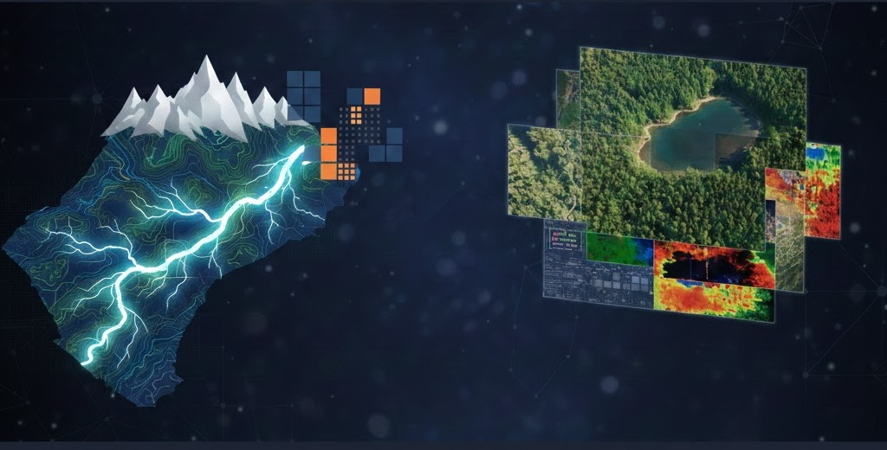

# Data-Acquisition-Processing-Analysis: Watershed Analysis, GeoSpatial, & Remote Sensing Modules
Welcome to the Data-Acquisition-Processing-Analysis Tutorial repository. The modules in this repository are designed to provide a comprehensive introduction to modern, programmatic workflows for hydrological and meteorological data retrieval and analysis.

## Overview
In the modules, we move away from manual data downloads (CSV/Excel) and toward API-driven reproducible research. You will learn how to delineate watersheds, pull long-term streamflow records, and integrate satellite-based snow and vegetation data.

## Core Topics Covered
Watershed Data: Automated delineation and catchment characteristic retrieval.

Streamflow: Accessing USGS NWIS and global runoff databases.

Meteorological Data: Integrating precipitation, temperature, and evapotranspiration grids.

Snow Hydrology: Analyzing Snow Water Equivalent (SWE) and snow cover extent.

Landsat & Remote Sensing: Utilizing multispectral imagery for land cover and water quality monitoring.

## The Tech Stack
We utilize three primary library ecosystems to handle these complex datasets:

1. HyRiver
The HyRiver suite is a powerful collection of Python packages designed for easy access to hydro-geospatial data via various web services (USGS, NHDPlus, etc.).

2. NSIDC (National Snow and Ice Data Center)
We utilize the NSIDC data access tools to pull critical snow-pack data. This is essential for understanding the seasonal water availability in mountain-west watersheds.

3. Google Earth Engine (GEE)
For large-scale remote sensing (Landsat), we use the ee Python API. This allows us to process petabytes of satellite imagery on Google's cloud infrastructure without downloading massive files locally.

## Getting Started
Environment Setup
To ensure all libraries (especially GDAL and HyRiver dependencies) work correctly, each module will have its own conda environment.

## Resources
[HyRiver Documentation](https://docs.hyriver.io/index.html)

[Google Earth Engine Guide](https://developers.google.com/earth-engine/guides)

[National Snow and Ice Data Center (NSIDC)](https://nsidc.org/home)
